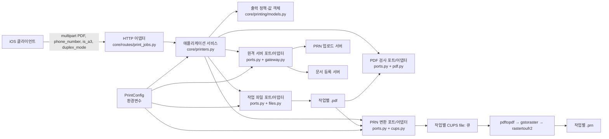

# 출력 변환 아키텍처

이 문서는 `verbose-waffle`의 PDF 업로드부터 Canon UFR II PRN 생성, 캠퍼스 서버 전송·등록까지의 책임 경계를 설명한다. 운영 절차는 [A4 자동 맞춤 운영 SOP](../sop/a4-auto-fit.md)를 따른다.

## 1. 설계 결정 요약

사용자 요구는 “A4보다 큰 PDF를 앱에서 출력해도 내용이 잘리지 않아야 한다”이다. 구현은 PDF 원본을 별도로 재작성하지 않고 CUPS 작업 티켓에 다음 두 값을 항상 명시하는 방식으로 해결한다.

```text
media=A4
print-scaling=auto-fit
```

API 요청의 `is_a3=true`이면 `media`만 구성된 A3 값으로 바뀐다. `auto-fit`은 입력 페이지가 선택한 용지보다 클 때 `fit` 방식으로 인쇄 가능 영역 안에 비율 유지 축소하고, 용지보다 작거나 같은 페이지는 강제로 확대하지 않는다. 따라서 대형·가로·혼합 크기 PDF도 페이지별로 CUPS 필터가 일관되게 배치한다. 반대로 정확히 A4인 full-bleed 페이지는 자동 축소 대상이 아닐 수 있으므로 약 5 mm의 PPD 비인쇄 여백에 있는 내용은 기존처럼 잘릴 수 있다. 이번 변경의 계약은 A4를 **초과하는** 페이지의 잘림 방지이다.

핵심 불변 조건은 다음과 같다.

1. 하나의 `PaperSize` 값이 CUPS `media` 옵션과 캠퍼스 문서 등록 payload 양쪽에 사용된다.
2. 배율 정책은 `auto-fit`, `fit`, `none` 중 하나이며 기본값은 `auto-fit`이다.
3. 배율 처리는 PRN 생성 후가 아니라 PDF가 CUPS 필터 체인에 들어갈 때 수행된다.
4. 각 작업은 고유 CUPS 파일 큐와 고유 PRN 경로를 사용한다.
5. 큐는 성공·실패와 관계없이 `finally` 경로에서 제거한다.

## 2. 전체 처리 흐름



외부에서 내부로 요청이 들어오지만, 애플리케이션 서비스가 구체적인 PDF 라이브러리나 CUPS subprocess 계약에 직접 묶이지 않도록 프로토콜 포트를 둔다. 구체 어댑터는 포트를 구현하고, 조립은 `main.py`에서 수행한다.

## 3. 계층과 파일별 책임

| 계층 | 파일 | 맡는 책임 | 맡지 않는 책임 |
| --- | --- | --- | --- |
| HTTP 어댑터 | `verbose-waffle/core/routes/print_jobs.py` | multipart 필드 수신, `is_a3`/양면 값 검증, 읽을 수 없는 PDF는 HTTP 400, 나머지 애플리케이션 오류는 상세를 숨긴 HTTP 500으로 변환 | CUPS 명령 생성, 파일 변환, 캠퍼스 서버 payload 조립 |
| 상태 확인 어댑터 | `verbose-waffle/core/routes/health.py` | 응답 본문 없는 `GET /healthz` HTTP 204 제공 | CUPS 상태 판정, 상세 진단 정보 공개 |
| 애플리케이션 서비스 | `verbose-waffle/core/printers.py` | 저장 → 검사 → 변환 → 업로드 → 등록 유즈케이스 순서와 정리 시점만 조정 | 파일 I/O 구현, requests 호출, CUPS 옵션 문자열, FastAPI 예외 생성 |
| 도메인 값 | `verbose-waffle/core/printing/models.py` | `PaperSize`, `PrintScaling`, `DuplexMode`, 결과 값과 허용값 검증 | 환경변수 읽기, subprocess 실행 |
| 애플리케이션 오류 | `verbose-waffle/core/printing/errors.py` | 저장·문서·변환·업로드·등록 실패를 구분하는 프레임워크 비의존 오류 | HTTP 상태와 응답 형식 결정 |
| 포트 | `verbose-waffle/core/printing/ports.py` | 업로드 문서, 파일 저장소, PDF 검사, PRN 변환, 원격 서버의 최소 인터페이스 정의 | 구체 라이브러리·경로·프로토콜 선택 |
| 파일 어댑터 | `verbose-waffle/core/printing/files.py` | 스트림 저장, 부분 저장 실패 정리, 정확한 작업 PDF/PRN 삭제 | 변환·원격 전송 순서 결정 |
| PDF 어댑터 | `verbose-waffle/core/printing/pdf.py` | `pypdf`로 페이지 수 검사, 빈 PDF 거부 | 용지 크기 정책 결정, PDF 리사이즈 |
| CUPS 어댑터 | `verbose-waffle/core/printing/cups.py` | CUPS 옵션 구성, 작업별 큐 생성, `lpr` 제출, 단일 deadline 안의 완료 대기, 비어 있지 않은 PRN 확인, 제한 시간 있는 큐 제거 | 캠퍼스 API 호출, HTTP 응답 결정 |
| 원격 서버 어댑터 | `verbose-waffle/core/printing/gateway.py` | PRN 업로드, 등록 payload 구성, connect/read timeout, HTTP 오류 검증, 단계별 오류 변환 | 로컬 파일과 CUPS 큐 수명주기 |
| 구성 | `verbose-waffle/core/config.py` | 환경변수 기본값·형식·허용값 검증 | 출력 실행 |
| 조립 | `verbose-waffle/main.py`, `verbose-waffle/core/dependencies.py` | 설정과 구현체를 한 번 조립해 FastAPI 의존성으로 제공 | 개별 출력 정책 구현 |
| 런타임 이미지 | `Dockerfile`, `docker-entrypoint.sh`, `cups-files.conf`, `docker-compose.yml` | CUPS/cups-filters/Canon 드라이버 설치, file device 허용, CUPS 시작·readiness fail-fast, 선택적 API/CUPS healthcheck, 환경변수 주입 | 요청별 업무 규칙 |

이 분리는 다음 변경 위치를 예측 가능하게 만든다.

* 허용할 배율 모드를 바꾸려면 `models.py`와 관련 테스트를 수정한다.
* 환경변수 이름이나 기본값을 바꾸려면 `config.py`, `.env.example`, `docker-compose.yml`을 함께 수정한다.
* Canon PPD용 CUPS 옵션을 바꾸려면 `cups.py`만 확인한다.
* 출력 처리 순서를 바꾸려면 `printers.py`, 파일 저장 정책은 `files.py`, 외부 서버 계약은 `gateway.py`를 확인한다.
* 저장·변환·업로드·등록의 오류 분류를 바꾸려면 `errors.py`와 라우트 매핑을 함께 확인한다.
* API 필드나 오류 코드를 바꾸려면 `routes/print_jobs.py`를 확인한다.
* 공개 메타데이터 정책과 라우터 조립은 `main.py`, 컨테이너 상태 확인 응답은 `routes/health.py`를 확인한다. `/openapi.json`, `/docs`, `/redoc`은 운영 애플리케이션에서 라우팅하지 않는다.

## 4. 요청부터 등록까지의 상세 순서

1. `POST /upload_file/`가 `phone_number`, 선택적 `is_a3`, 선택적 `duplex_mode`, PDF `file`을 받는다.
2. 라우트는 `is_a3`를 명시적인 불리언 표기로 검증하고 양면 값을 `DuplexMode`로 정규화한다. 지원하지 않는 값은 CUPS에 도달하기 전에 HTTP 400으로 거부한다.
3. `PrintJobService`는 UUID 작업 ID를 만들고 `LocalJobFileStore`에 저장을 위임한다. 파일 저장이 중간에 실패하면 부분 PDF를 즉시 지운다.
4. `PyPdfDocumentInspector`가 페이지 수를 읽는다. 빈 파일·손상 파일처럼 읽을 수 없는 문서는 `InvalidPrintDocumentError`를 거쳐 HTTP 400이 된다.
5. `PaperSize.from_is_a3()`가 요청을 A4 또는 A3 값 하나로 변환한다.
6. `CupsPrintFileConverter`는 기존 동일 경로가 없음을 확인한 뒤 `PRINT_OUTPUT_DIR/<JOB_ID>.prn`을 대상으로 하는 작업별 CUPS 파일 큐를 만든다.
7. 같은 `PaperSize`를 이용해 `media`, `print-scaling`, 흑백, 양면 옵션을 순서가 고정된 `lpr` 인수 배열로 만든다. 셸 문자열 보간은 사용하지 않는다.
8. CUPS가 PDF를 PPD의 인쇄 가능 영역에 배치하고 Canon UFR II PRN으로 변환한다.
9. 변환기는 `lpstat -W not-completed -o <QUEUE_NAME>`가 비고 PRN이 0바이트보다 클 때까지 하나의 전체 deadline 안에서 기다린다. `<QUEUE_NAME>`은 애플리케이션 작업 ID와 동일하게 만든 임시 destination 이름이며, CUPS가 표시하는 `QUEUE-N` 형식의 숫자 request ID가 아니다. CUPS subprocess locale은 `C`로 고정한다.
10. 작업별 큐를 별도의 짧은 cleanup timeout 안에서 제거한다. 변환이나 대기 중 오류가 발생해도 제거를 시도하며 원래 실패 단계와 원인은 보존한다.
11. `RequestsPrintServerGateway`가 connect/read timeout과 HTTP 상태 검사를 적용해 PRN을 업로드한 뒤 문서 메타데이터를 등록한다. 등록 payload의 용지는 5단계에서 만든 동일한 `PaperSize`이다.
12. `PRINT_RETAIN_JOB_FILES=false`이면 성공·실패 모두에서 `LocalJobFileStore`가 해당 작업의 PDF와 PRN만 정리한다. 정리 실패는 원래 작업 결과를 덮지 않고 로그로 남긴다.

## 5. 용지와 배율 정책

### 5.1 API 용지 매핑

| API 입력 | 도메인 값 | CUPS 작업 옵션 | 등록 payload |
| --- | --- | --- | --- |
| 누락 또는 `0`, `false`, `no`, `off` | `PaperSize.A4` | `media=${PRINT_CUPS_MEDIA_A4}` | `size=A4` |
| `1`, `true`, `yes`, `on` | `PaperSize.A3` | `media=${PRINT_CUPS_MEDIA_A3}` | `size=A3` |
| 그 외 문자열 | 없음 | CUPS에 제출하지 않음 | HTTP 400 |

용지 이름은 PPD마다 다를 수 있으므로 CUPS에 보내는 실제 키워드는 환경변수로 분리한다. 반면 캠퍼스 등록 계약은 도메인 값 `A4`/`A3`을 그대로 사용한다.

### 5.2 배율 모드

| 설정 | 동작 | 운영 용도 |
| --- | --- | --- |
| `auto-fit` | 선택 용지보다 큰 페이지에만 `fit`을 적용해 인쇄 가능 영역 안으로 비율 유지 축소한다. 용지보다 작거나 같은 페이지는 확대하지 않는다. 정확히 A4인 full-bleed 내용은 비인쇄 여백 때문에 기존처럼 잘릴 수 있다. | 기본값이자 권장값. 대형 문서 잘림 방지 요구를 충족한다. |
| `fit` | 크고 작은 페이지 모두 인쇄 가능 영역에 맞춘다. A5 같은 작은 페이지도 확대될 수 있다. | 의도적으로 모든 페이지를 최대 크기로 맞출 때만 사용한다. |
| `none` | 확대·축소하지 않는다. 용지보다 큰 내용은 잘릴 수 있다. | 자동 맞춤 자체가 장애 원인일 때만 쓰는 긴급 롤백 모드이다. |

`fill`은 용지를 채우기 위해 일부 내용을 자를 수 있어 허용하지 않는다. 잘못된 값은 `PrintConfig.from_env()`가 애플리케이션 시작 시점에 거부한다. `auto_fit`처럼 밑줄을 사용한 표기는 내부에서 `auto-fit`으로 정규화하지만, 운영 파일에는 표준 표기인 `auto-fit`을 사용한다.

## 6. CUPS/Canon 변환 경계

현재 컨테이너는 Debian Bookworm 기반 CUPS, cups-filters, Canon UFR II 6.20 드라이버를 설치한다. Docker 빌드 중 다음 필수 구성요소가 없으면 즉시 실패한다.

* `/usr/lib/cups/filter/pdftopdf`
* `/usr/lib/cups/filter/rastertoufr2`
* `/usr/share/cups/model/CNRCUPSIRADV45453ZK.ppd`
* `/usr/lib/libcanonufr2r.so.1`

현재 Canon PPD의 A4 물리 크기는 약 `595.3 × 841.9 pt`이고 인쇄 가능 영역은 `[14.173, 14.173, 581.127, 827.727] pt`이다. 네 변에 약 5 mm의 비인쇄 여백이 있으므로 대형 페이지는 단순히 물리 A4 크기로만 바꾸는 것이 아니라 PPD를 사용한 `fit` 배치가 필요하다. `auto-fit`이 정확한 A4를 그대로 두는 동작은 이 비인쇄 여백 자체를 없애지 않는다.

이 PPD의 대표적인 변환 경로는 다음과 같다.

```text
application/pdf
  → pdftopdf
  → application/vnd.cups-pdf
  → gstoraster
  → application/vnd.cups-raster
  → rastertoufr2
  → file:///.../<JOB_ID>.prn
```

`media`와 `print-scaling`은 첫 페이지 배치 단계에 전달된다. 이미 생성된 PRN을 나중에 확대·축소하지 않는다. PRN 이후에는 PDF의 페이지 상자·벡터·폰트 의미가 사라졌거나 장치 형식으로 변환되었기 때문이다.

현재 `lpr` 호출에는 `-l` 또는 `-o raw`가 없다. 이 옵션들은 PDF 필터를 우회해 `pdftopdf`의 자동 맞춤을 무력화하므로 추가하면 안 된다. 배율은 backend나 생성된 PRN을 수정하는 방식이 아니라 `CupsPrintOptionsBuilder`의 작업 옵션으로만 제어한다.

`cups-files.conf`의 `FileDevice Yes`는 작업별 `file:` URI를 허용한다. 이 기능은 CUPS에서 폐기 예정인 레거시 경계이므로 외부 입력을 장치 URI로 사용해서는 안 된다. 현재 구현은 서버가 만든 작업 ID와 구성된 출력 디렉터리만 사용한다.

### 작업별 큐를 사용하는 이유

하나의 고정 `file:/.../output.prn` 큐를 공유하면 동시 요청이 같은 파일을 덮어쓸 수 있다. 현재 구현은 큐 이름과 출력 파일에 동일한 고유 작업 ID를 사용하고, 기존 PRN 경로 재사용을 거부한다. 큐 생성에 성공한 뒤의 모든 경로에서 `lpadmin -x <JOB_ID>`를 실행하므로 정상 처리와 오류 처리의 큐 수명주기가 같다.

변환기에서 발생한 외부 명령 오류, 제한 시간 초과, PRN 누락·0바이트는 실패 단계가 포함된 `CupsConversionError`로 애플리케이션 경계에 전달된다. 명령 오류는 실행 파일, 종료 코드, stderr를 보존한다. 라우트는 클라이언트에 내부 상세를 노출하지 않는 HTTP 500을 반환하고 서버 로그에는 예외 체인을 남긴다.

현재 컨테이너는 `lpadmin`으로 요청별 큐를 만들기 위해 root로 실행된다. `docker-entrypoint.sh`가 CUPS를 시작하고 `lpstat -r` readiness가 성공한 경우에만 API를 실행한다. 향후 non-root 실행으로 바꾸려면 큐 관리 권한 또는 제한된 별도 helper 설계를 먼저 마련해야 하며, 단순히 Compose의 `user`만 변경하면 출력이 깨진다.

## 7. 구성 소유권

운영 기본값과 전체 변수는 루트의 `.env.example`에 있다. Docker Compose는 값을 컨테이너 환경변수로 전달하고, `PrintConfig.from_env()`가 애플리케이션 시작 시 검증한다.

* 비어 있으면 안 되는 문자열: 입출력 경로, 모델, A4/A3 media, 업로드/등록 주소
* 유한하고 양수여야 하는 실수: CUPS 전체 제한 시간, 폴링 간격, 큐 정리 제한 시간, HTTP 연결/응답 제한 시간
* 양수 정수: 프랜차이즈 ID
* 불리언: `1/true/yes/on`, `0/false/no/off`
* 배율: `auto-fit`, `fit`, `none`

`PRINT_HEALTHCHECK_DISABLED`는 `PrintConfig`가 아니라 호스트의 Docker Compose가 읽는 배포 옵션이다. 이 값은 `true` 또는 `false`만 사용한다. 검사 명령·간격·제한 시간은 `Dockerfile`이 단독 소유하고 Compose는 활성 여부만 덮어쓴다.

직접 `PrintConfig()`를 만드는 단위 테스트의 `temp_dir` 기본값은 상대 경로 `temp`이지만, 실제 Compose 배포는 `PRINT_TEMP_DIR=/temp`를 명시한다. 운영 판단은 항상 Compose와 유효 환경변수를 기준으로 한다.

기본 `docker-compose.yml`은 `./temp:/temp`만 바인드하고 애플리케이션 소스는 바인드하지 않는다. 실행 코드는 이미지 빌드 시 `/opt/project/verbose-waffle`에 복사된 버전으로 고정된다. 이 불변 조건을 깨고 호스트 소스를 덮어쓰면 자동 검증한 이미지와 운영 코드가 달라지고 이미지 태그 롤백도 무효가 되므로, 운영 Compose에 소스 bind mount를 추가하지 않는다.

## 8. 파일·로그와 개인정보

업로드 PDF, PRN, 원본 파일명, 전화번호는 개인정보 또는 민감한 문서 내용을 포함할 수 있다.

* PDF: 기본 Compose 경로 `/temp/<JOB_ID>.pdf`; 호스트의 `./temp`에 바인드된다.
* PRN: 기본 경로 `/root/<JOB_ID>.prn`; 컨테이너 내부에 저장된다.
* 애플리케이션 표준 출력: 성공한 작업 ID, 페이지 수, 출력 정책, HTTP 상태 요약을 기록한다. 호환성과 장애 추적을 위해 기본값에서는 전화번호와 원본 파일명도 기록한다. `PRINT_LOG_PHONE_NUMBER=false`, `PRINT_LOG_FILE_NAME=false`로 각 필드를 독립적으로 제외할 수 있으며 외부 응답 본문은 기록하지 않는다. 오류 로그와 CUPS 로그에는 작업 ID나 생성 파일 경로가 포함될 수 있다.
* CUPS 로그: `/var/log/cups/error_log`, `access_log`, `page_log`에 작업 이름과 상태가 남을 수 있다.

호환성과 장애 분석을 위해 `PrintConfig`의 파일 보존 기본값은 `PRINT_RETAIN_JOB_FILES=true`이지만 Compose는 `false`를 명시한다. 개인정보 최소 보관 원칙상 일반 운영에서는 파일 보존을 끄고, 전화번호·파일명 로그가 필요한 기간과 접근자를 정한다. 로그나 파일을 이슈·메신저에 첨부할 때는 전화번호, 파일명, 작업 ID, 문서 내용을 제거한다. 삭제는 반드시 확인된 작업 ID의 정확한 파일만 대상으로 하며 와일드카드나 광범위한 재귀 삭제를 사용하지 않는다.

## 9. 테스트 경계

| 테스트 | 검증 대상 | 외부 시스템 사용 여부 |
| --- | --- | --- |
| `tests/test_printing_models.py` | 용지 매핑, 배율 허용값, 양면 정규화 | 없음 |
| `tests/test_print_config.py` | 환경변수 기본값·재설정·시작 시 실패 | 없음 |
| `tests/test_pdf_inspector.py` | 페이지 수, 빈 PDF 거부, 2쪽 안전 여백 양면 fixture 계약 | 없음 |
| `tests/test_print_jobs_route.py` | `is_a3`의 명시적 불리언 파싱과 잘못된 값 거부 | 없음 |
| `tests/test_printing_adapters.py` | 부분 저장 정리, HTTP timeout/상태 검사, 단계별 gateway 오류, 등록 용지 | HTTP 테스트 대역 사용 |
| `tests/test_cups_printing.py` | 정확한 `lpr` 인수, 단일 deadline, 기존/빈 PRN 거부, 실패 단계, 모든 경로의 큐 제거 | CUPS 테스트 대역 사용 |
| `tests/test_print_job_service.py` | CUPS/등록에 동일한 용지 사용, 완료 로그의 전화번호·파일명 토글, 잘못된 PDF 및 외부 실패 시 파일 정리 | 모든 외부 포트의 테스트 대역 사용 |
| `tests/test_cups_integration.py` | 실제 `pdftopdf`로 5종 합성 PDF의 A4 MediaBox·네 모서리 렌더 보존을 검사하고 실제 Canon CUPS로 PRN 생성 | 로컬 컨테이너 CUPS/Poppler만 사용 |
| `scripts/generate_print_fit_fixtures.py` | 실물 검수용 A3 세로·가로, A4, A5, 혼합 크기 및 2쪽 양면 합성 PDF 생성 | 없음 |

통합 테스트는 A3 세로·가로, 정확한 A4, A5, A3/A4/A5 혼합 PDF의 페이지 수와 A4 MediaBox를 검사하고, Poppler 72 DPI 렌더에서 네 색 모서리 표식이 경계에 닿지 않고 남는지 확인한다. 별도의 실제 CUPS 테스트는 Canon PRN 생성과 큐 정리를 검증한다. 그러나 급지·물리 여백·프린터 기계 동작은 자동화가 대신할 수 없으므로 실물 인수 테스트가 최종 품질 게이트이다.

## 10. 알려진 경계와 후속 과제

* 현재 PDF 검사는 페이지 수와 빈 문서만 확인한다. 암호화, 최대 파일 크기, 손상 파일에 대한 별도 제품 정책은 없다.
* CUPS 미완료 작업이 사라지고 비어 있지 않은 PRN이 생긴 것은 가상 파일 큐 변환 완료를 뜻하며, 캠퍼스의 실제 프린터가 종이를 출력했다는 보장은 아니다.
* PPD와 `file:` backend는 레거시 CUPS 방식이다. 장기적으로는 IPP Everywhere/Printer Application 기반 변환기로 이동하는 것이 바람직하다.
* 캠퍼스 업로드·등록 요청은 유한한 connect/read timeout과 HTTP 상태 검사를 적용하지만 자동 재시도는 하지 않는다. 현재 구현의 `verify=False`는 기존 보안 부채이므로 신규 연동의 기준으로 복제하지 않는다.
* 자동화 CI/CD가 저장소에 없으므로 단위 테스트, CUPS 통합 테스트, 실물 인수, 이미지 태깅과 배포는 SOP에 따라 수동 수행한다.

## 11. 표준 및 운영 참고 자료

* [PWG IPP Print Job Template Attributes](https://www.pwg.org/ipp/print.html): `print-scaling` 속성과 표준 문서 연결
* [PWG 5100.13-2023 IPP Driver Replacement Extensions v2.0](https://ftp.pwg.org/pub/pwg/candidates/cs-ippnodriver20-20230301-5100.13.pdf): `auto-fit`, `fit`, `none`의 규범적 의미
* [PWG How to Use the Internet Printing Protocol](https://www.pwg.org/ipp/ippguide.html): IPP 출력 속성과 capability 조회 개요
* [CUPS Command-Line Printing and Options](https://openprinting.github.io/cups/doc/options.html): `media`, 양면, 맞춤 옵션
* [CUPS Design Description](https://openprinting.github.io/cups/doc/spec-design.html): 필터와 backend 처리 구조
* [CUPS lpadmin(8)](https://openprinting.github.io/cups/cups-local/lpadmin.html): 큐 생성·삭제·기본 옵션 관리
* [CUPS lpstat(1)](https://openprinting.github.io/cups/cups-local/lpstat.html): 미완료 작업 조회와 옵션 순서
* [CUPS cups-files.conf(5)](https://openprinting.github.io/cups/doc/man-cups-files.conf.html): `FileDevice`의 동작과 제약
* [OpenPrinting cups-filters](https://github.com/OpenPrinting/cups-filters): `pdftopdf` 등 필터 구현과 호환성 정보
